# Results gallery — what goes in, what comes out

Everything below was produced by running the seven `cryosim` commands on the
two shipped example configs. Full console logs live next to the images in
[`docs/results/`](results/). Regenerate any of it with the commands shown.

---

## The input

One YAML file describes the whole system. This is
[`examples/lch4_coupled_burn.yaml`](../examples/lch4_coupled_burn.yaml)
(abridged — see the file for every key):

```yaml
mode: coupled
fluid: LCH4                     # tank fluid = regen coolant, swappable

tank:
  radius: 0.20                  # 0.4 m diameter, student scale
  cyl_length: 1.0
  bottom_dome: elliptical       # 2:1 heads
  top_dome: elliptical
  wall_mass: 25.0
  heat_flux: 150.0              # W/m2 pad/ascent heating
  thermal: {pressurant_setpoint: 300000.0, pressurant_max_flow: 0.1}

initial: {pressure: 300000.0, fill_fraction: 0.9, T_liquid: 118.0}

engine:                         # ~5 kN LOX/CH4 at Pc = 30 bar
  throat_radius: 0.019
  contraction_ratio: 6.0
  expansion_ratio: 4.5
  chamber_length: 0.09
  mixture_ratio: 3.4
  gas: lox/ch4                  # CEA-derived preset (replace with your CEA run)
  channels: {n_channels: 60, channel_width: 0.0010,
             channel_height: 0.0014, t_wall: 0.0007, k_wall: 330.0}

burn:
  t_end: 20.0
  pc: 3000000.0                            # Pa (tables allowed)
  axial_accel_g: [[0.0, 3.0], [20.0, 7.0]] # 3 g -> 7 g ramp
  lateral_accel: {amplitude: 0.8, frequency: 0.9}  # near 1st slosh mode

coupled:
  dt: 0.25
  pump_dp: 8700000.0            # e-pump to ~90 bar channels (supercritical CH4)
  c_mix: 5.0                    # slosh->thermal mixing gain (UNVALIDATED knob)

feed_system: {pressurization: optimal, ...}   # for `cryosim pid`
optimize:    {dp_budget: 2500000.0, ...}      # for `cryosim optimize`
gimbal:      {dry_mass: 60.0, thrust: 5000.0, gust: {...}, ...}
cfd:         {n_axial: 120, n_radial: 24, ...}
manifold:    {target_maldistribution: 0.03, ...}
```

The second config, [`examples/lox_tank_selfpress.yaml`](../examples/lox_tank_selfpress.yaml),
is a tank-only LOX pad-hold case (0.3 m tank, 50 W/m², 1 hour, no engine).

---

## 1 — Tank-only: LOX self-pressurization on the pad

```
cryosim run examples/lox_tank_selfpress.yaml
→ P: 2.00 -> 3.17 bar over 1 h        (console_lox_tank.txt)
```

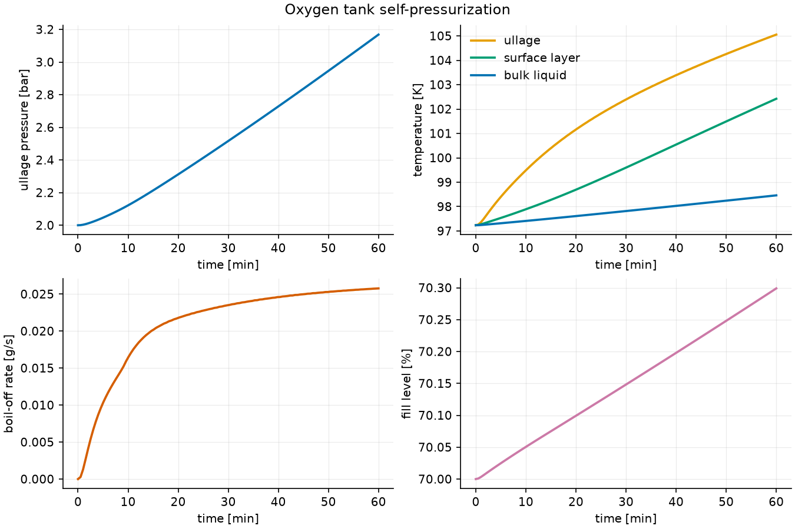
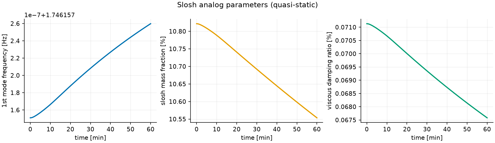

## 2 — Coupled burn: tank → slosh → regen → injector

```
cryosim run examples/lch4_coupled_burn.yaml
→ fill 90% -> 76%, ullage held at 3.00 bar (autogenous)
→ injector inlet T 541-542 K, peak wall 1015 K, injector margin 32.6 bar
```

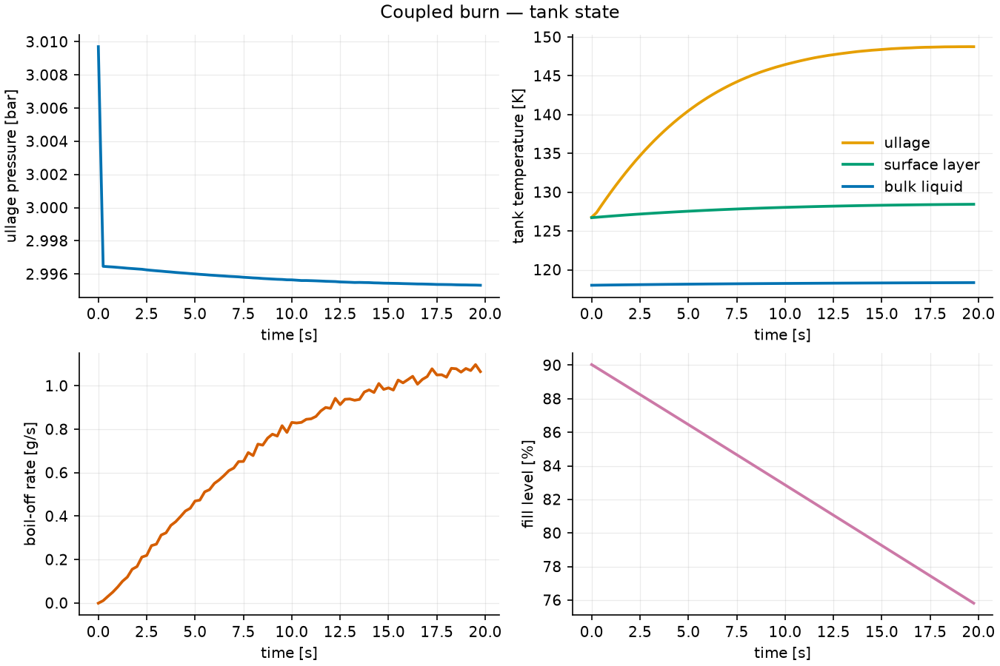
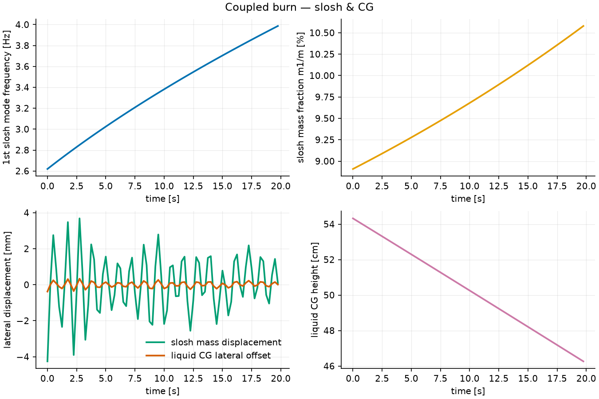
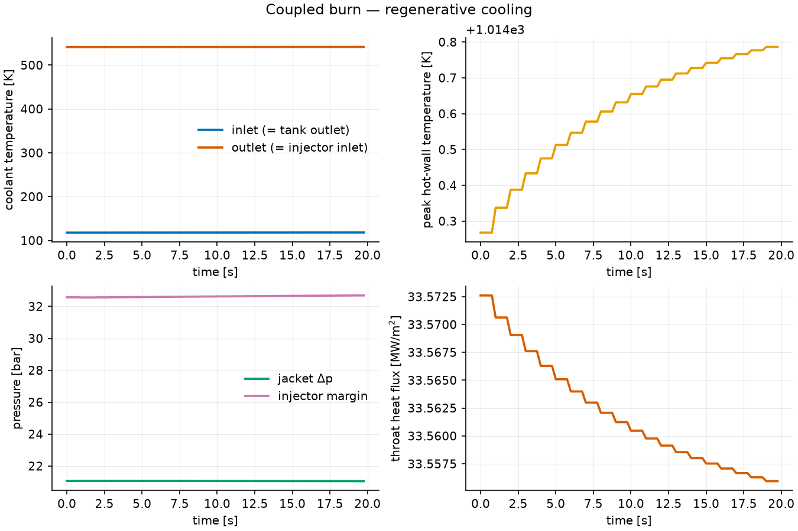
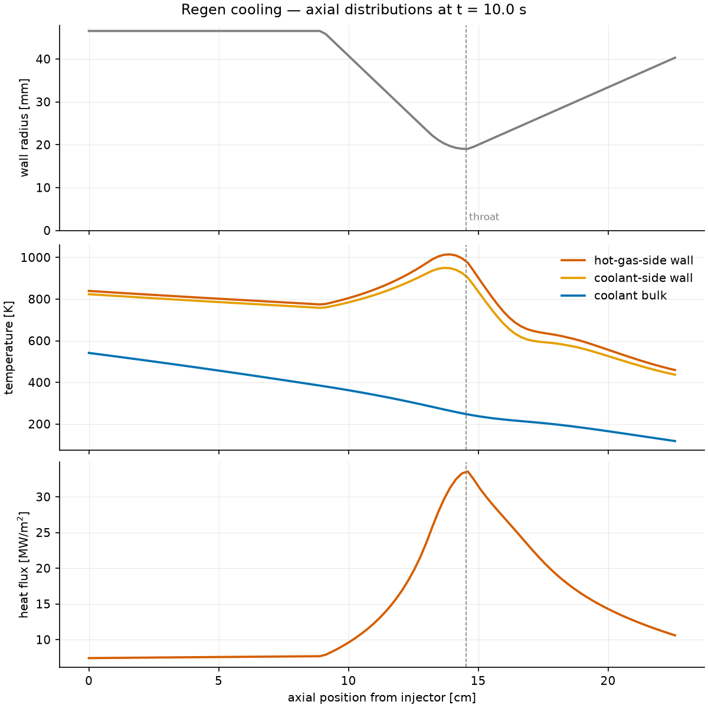

## 3 — Feed-system P&ID + auto line sizing + fittings

```
cryosim pid examples/lch4_coupled_burn.yaml
→ selected architecture: pump  (CH4 needs ~61 bar channels > 0.85 * P_crit)
→ tube specs annotated on the drawing; full report in console_pid.txt
```

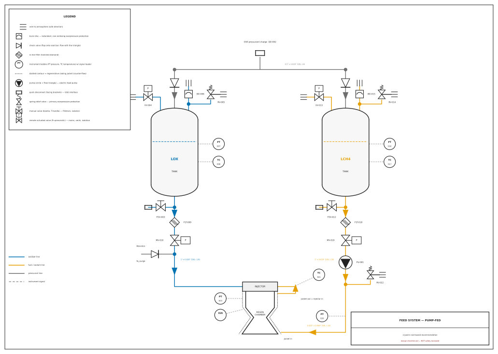
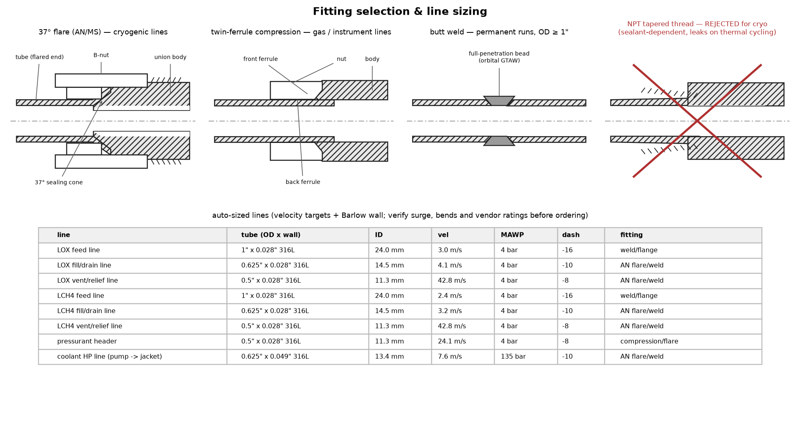

## 4 — Automatic gimbal (TVC) stabilization with slosh

```
cryosim gimbal examples/lch4_coupled_burn.yaml
→ auto-tuned PD gains from vehicle inertia/thrust; closed loop STABLE
→ 120 N nose gust: max |theta| = 4.30 deg, settled
```

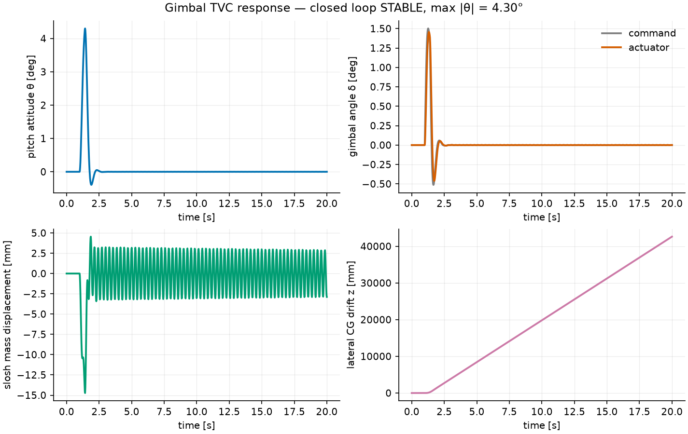

## 5 — Euler CFD check of the quasi-1D assumption

```
cryosim cfd examples/lch4_coupled_burn.yaml
→ mass flow: CFD 1.928 kg/s vs quasi-1D 1.872 kg/s (+3.0%)
→ exit Mach: CFD centerline 2.41 vs quasi-1D 2.60   (inviscid check only)
```

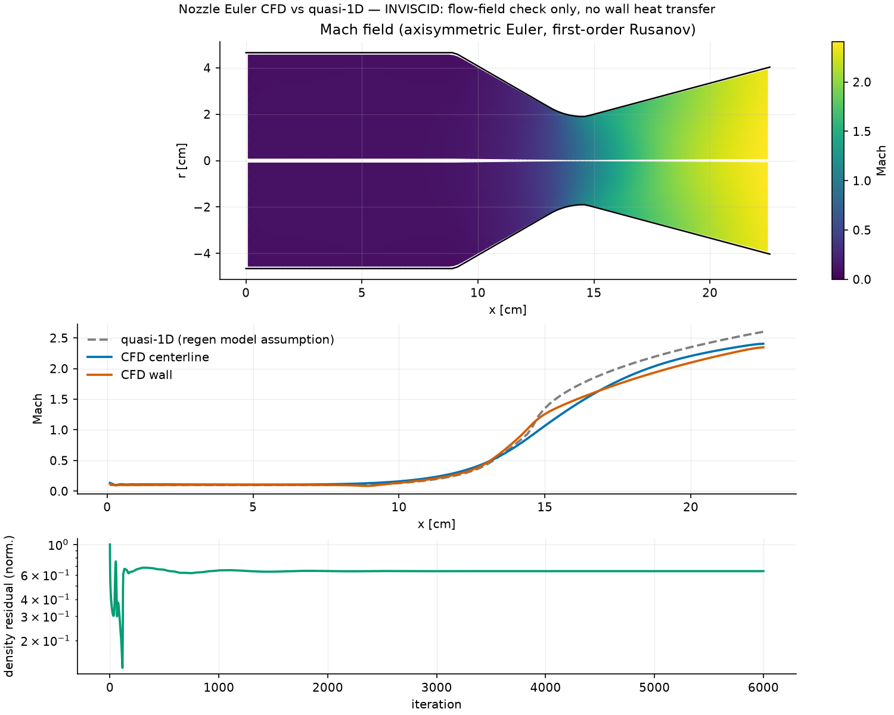

## 6 — Automatic torus-manifold design

```
cryosim manifold examples/lch4_coupled_burn.yaml
→ flow uniformity (max-min)/mean = 1.09% (target 3.0%)
→ inlet torus 6.5 mm / outlet 19.5 mm ID, ports aligned (auto clocking)
```

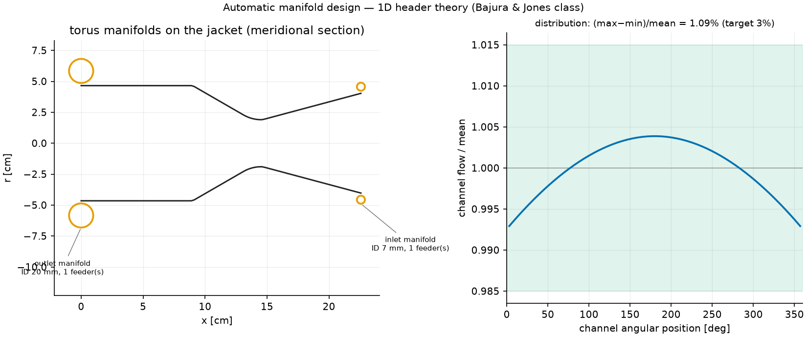

## 7 — Max-performance channel optimization

```
cryosim optimize examples/lch4_coupled_burn.yaml
→ 220 channels, 0.30 x 2.07 mm (HARCC-style; flagged: needs EDM/AM)
→ peak wall 1014 -> 711 K AND dP 20.9 -> 17.9 bar vs baseline
```

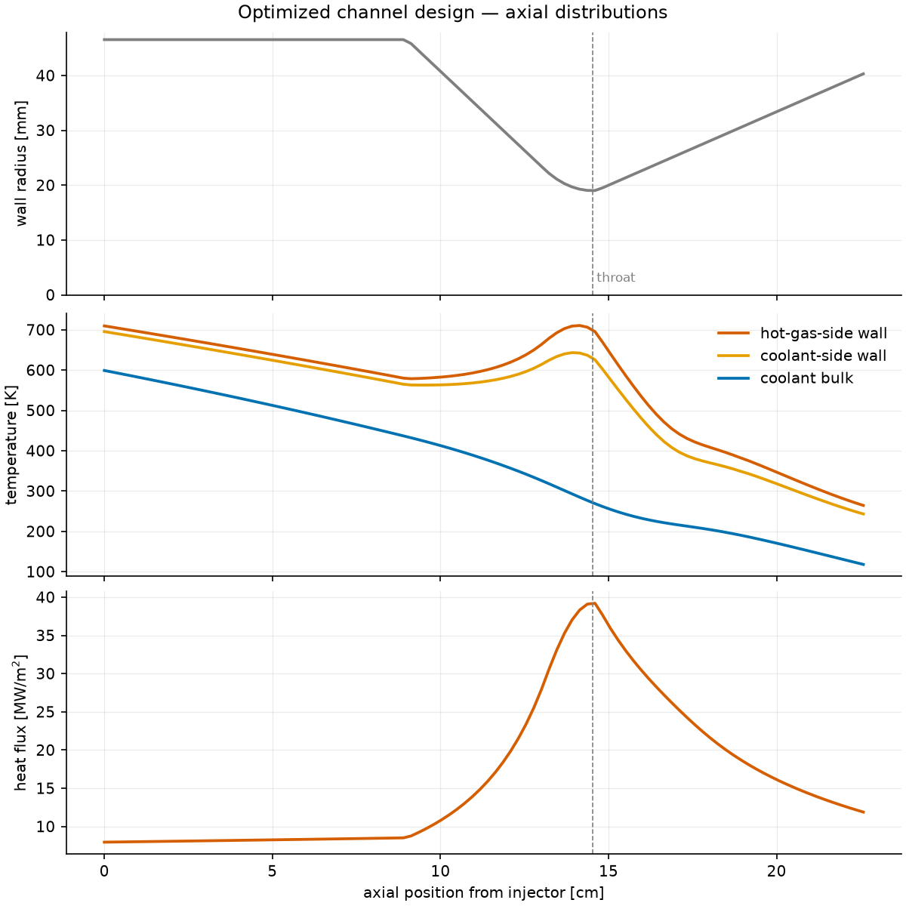

## 8 — Computed vs literature values

```
cryosim benchmark --full
→ 22/22 within tolerance/band
```

Every computed number next to its NIST / handbook / experiment-band
reference, with source and deviation: **[benchmarks.md](results/benchmarks.md)**.

---

*Every number above regenerates deterministically from the configs; see the
[README](../README.md) for the physics, assumptions, and — importantly —
the validation status of each model.*
