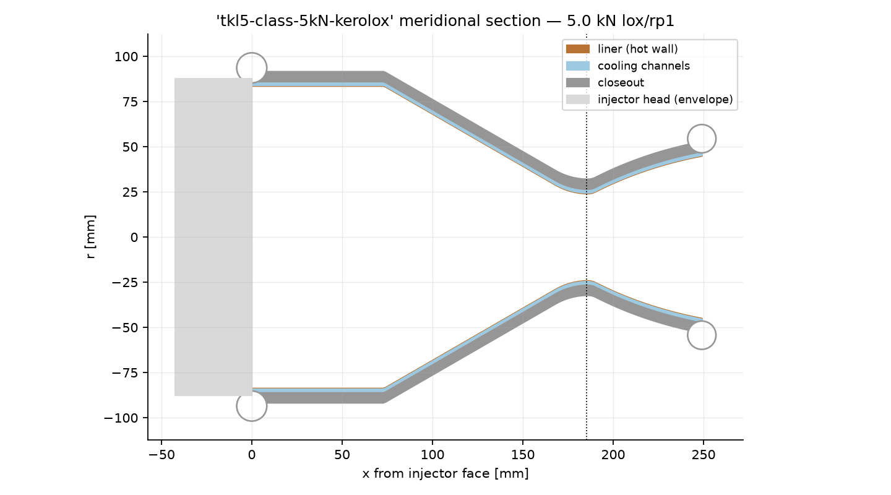
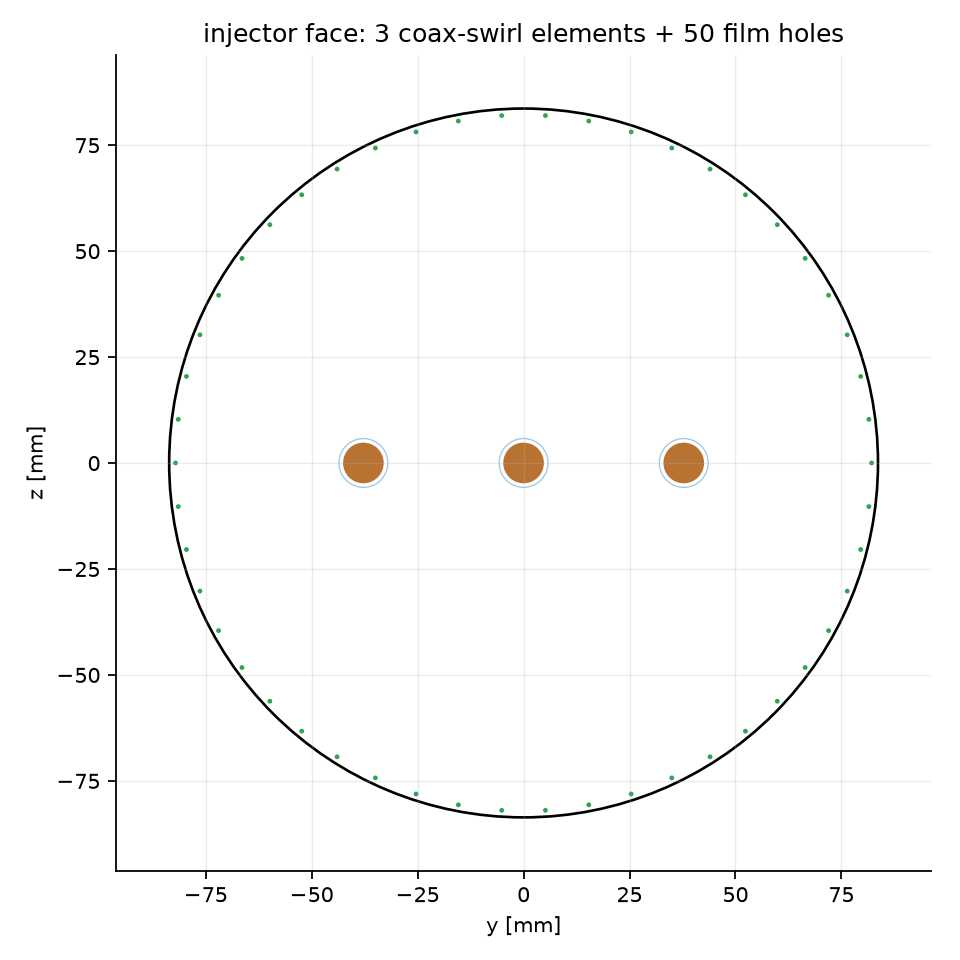
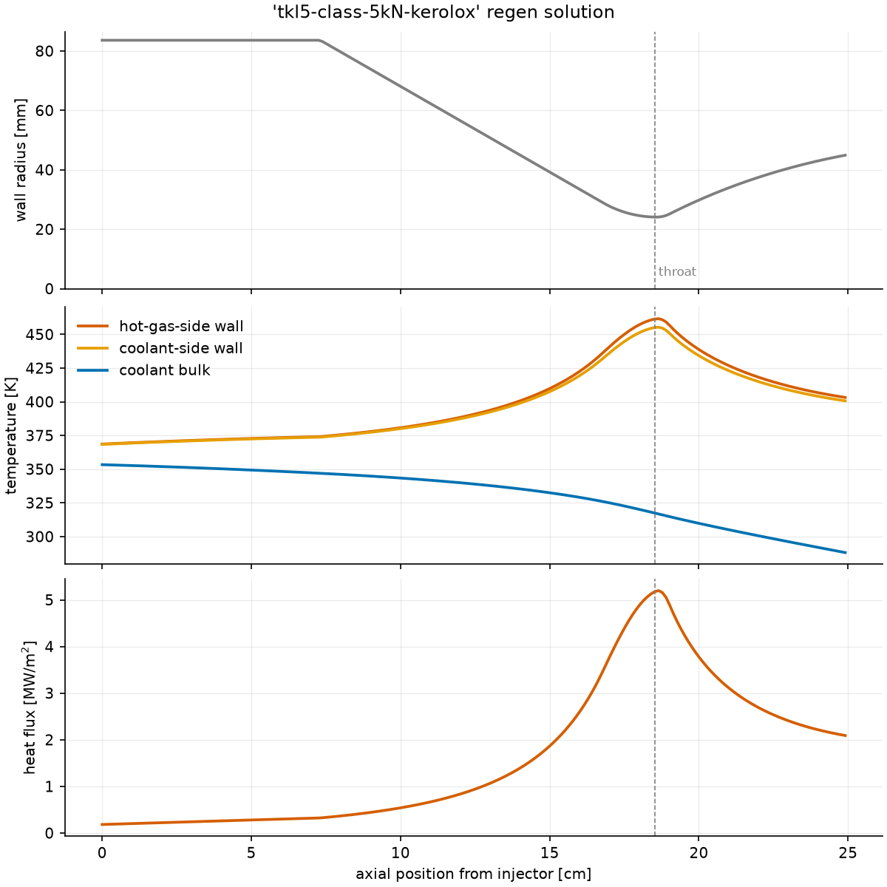
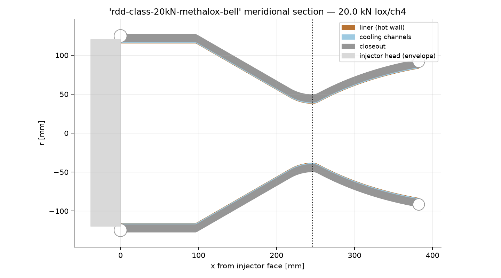
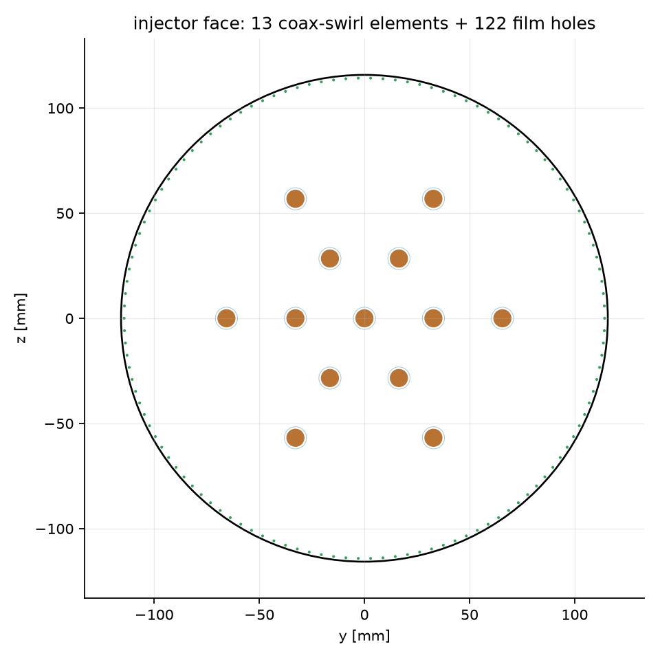
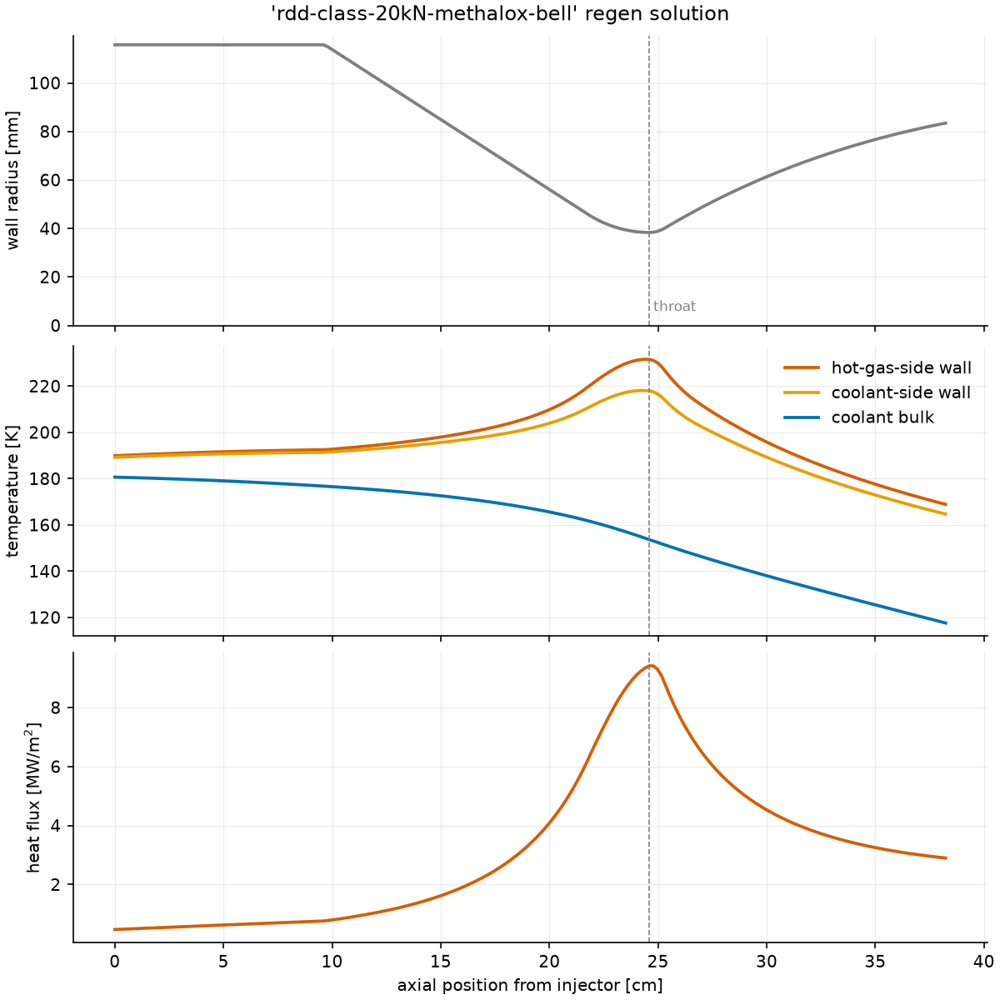
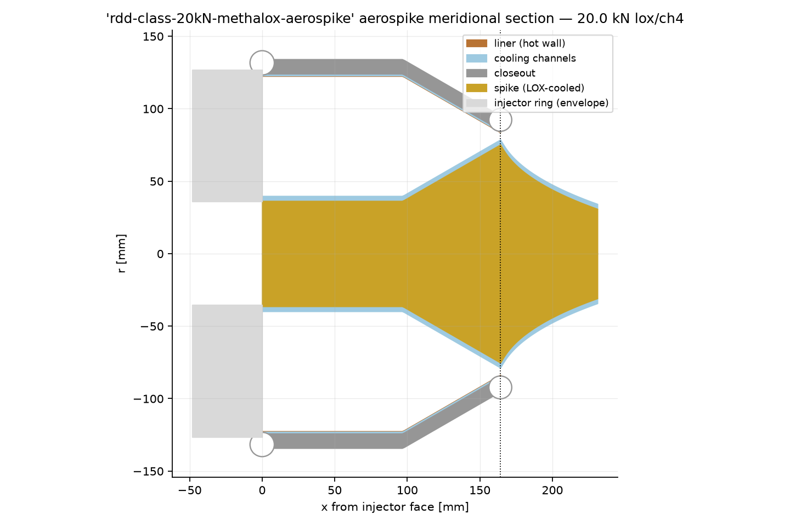
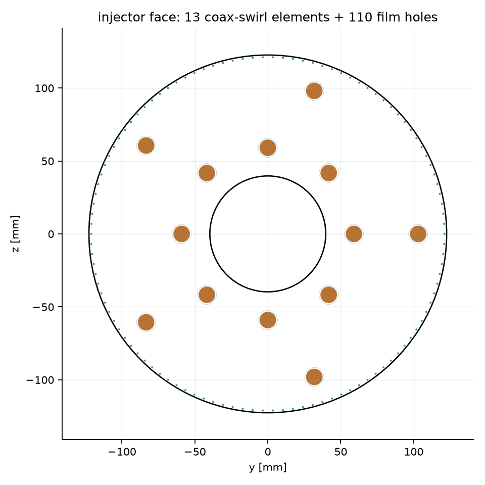
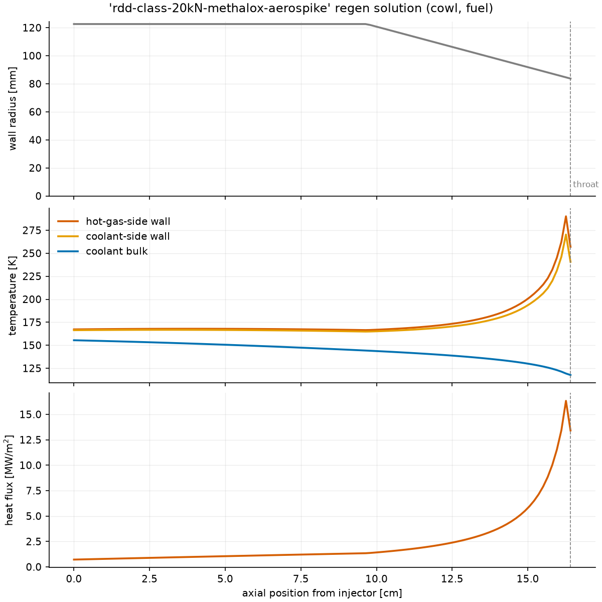
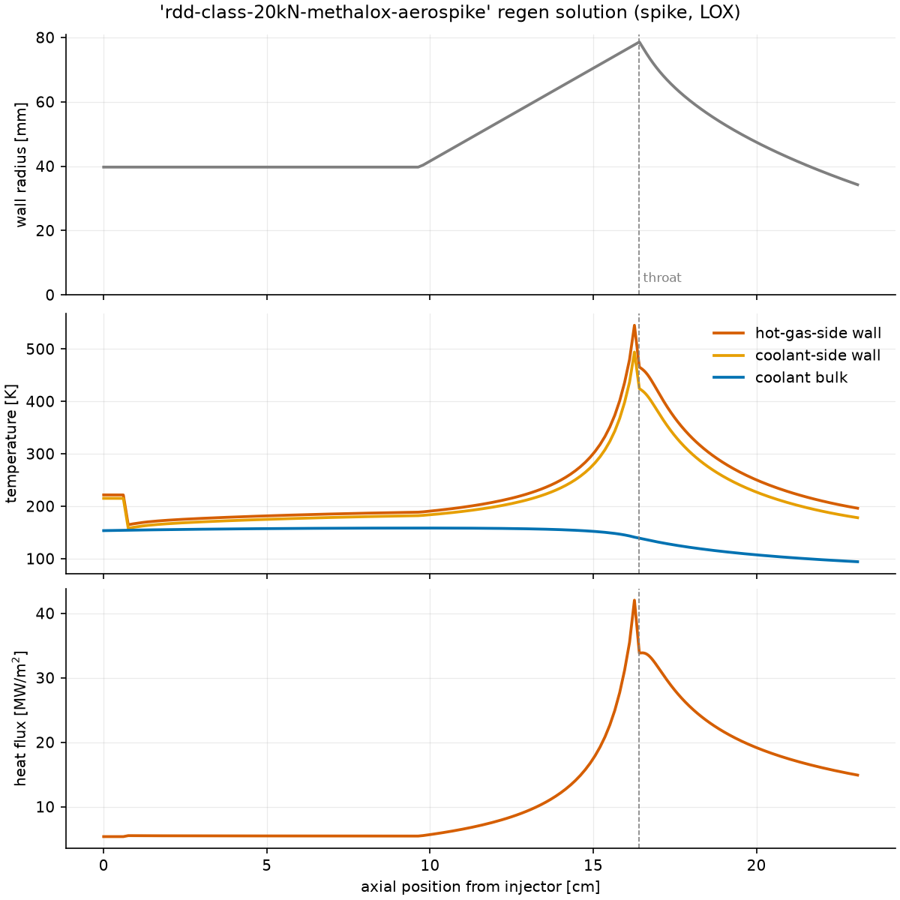

# LEAP 71 parity — the reference engine lineup

LEAP 71 has publicly hot-fired three Noyron-generated engines. This page
designs cryosim equivalents of all three from **the published requirements
only**, using the shipped pipeline (`cryosim design`), and puts what the
tool produces next to what LEAP 71 has published.

**What "parity" honestly means here.** LEAP 71 publishes requirements and
hardware facts (thrust class, propellants, mixture ratio, material,
single-piece LPBF manufacture, burn durations) — not chamber pressures,
Isp, or drawings. So the parity claim is made at the level the data
supports:

* **structure parity** — the same class of engine comes out: single-piece
  printable geometry with integral regen channels, torus manifolds,
  coax-swirl injector head, film cooling, and (for the aerospike) a
  toroidal chamber with a LOX-cooled truncated spike — every part
  watertight in mesh QA;
* **performance parity** — the computed performance lands inside the
  published class bands for that propellant/cycle/pressure class, with a
  full constraint ledger and an independent verification pass, and every
  number traceable in `trace.md`;
* the **generation tier matches**: like Noyron, this pipeline generates
  from encoded engineering logic and verifies with independent analysis —
  it does not replace the RANS/FEA/hot-fire campaign that qualifies
  flight hardware (see the README fidelity-tier table).

Chamber pressures below are *chosen* (stated per engine), because LEAP 71
does not publish them.

---

## 1 — TKL-5 class: 5 kN kerolox thruster

**LEAP 71 published** (June 2024, Airborne Engineering, Westcott):
5 kN thrust, LOX/kerosene, nominal O/F 2.3 (first fired at 1.8, then a
12 s steady burn at 2.3), CuCrZr, printed as a single piece, designed by
Noyron in under two weeks.

**cryosim input**: [`examples/engine_5kn_kerolox_tkl5.yaml`](../../examples/engine_5kn_kerolox_tkl5.yaml)
— 5 kN, `lox/rp1`, O/F 2.3, 20 bar (chosen, pressure-fed class), CuCrZr,
LPBF, film ring credited thermally, **Bartz uncalibrated** (factor 1.0 —
fully conservative). [Console log](console_tkl5.txt).

| quantity | computed | context |
|---|---|---|
| Isp (SL / vac) | 240 / 270 s | kerolox pressure-fed class at 20 bar (Sutton class values ~230–260 SL) |
| throat / exit Ø | 48.2 / 89.9 mm | 80% bell, ε 3.5 (perfect SL expansion) |
| mass flow | 2.13 kg/s at O/F 2.30 | the published mixture ratio |
| peak hot wall | 462 K CuCrZr | ≤ 800 K limit |
| **coking guard** | **455 K coolant-side wall** | ≤ 590 K RP-1 limit (NASA SP-8087) — the kerolox-specific quality gate |
| ledger | **14/14 PASS** incl. 3 `verify:` items | Euler CFD +2.6% vs quasi-1D |
| geometry | jacket + injector + assembly, **all watertight** | single-piece-printable implicit model |





Without the film credit the same requirements **fail loudly** on the
coking/wall guards — which is the correct engineering statement: a 5 kN
kerolox chamber in printed copper needs its film cooling, exactly as
TKL-5 flies it.

---

## 2 — RDD class: 20 kN methalox bell

**LEAP 71 published** (December 2025, with Aconity3D): ~20 kN (2 t)
thrust on cryogenic LOX/CH4, conventional bell nozzle, CuCrZr, printed in
one piece, orbital-launcher class; bell and aerospike generated by the
same model from the same physics.

**cryosim input**: [`examples/engine_20kn_methalox_bell.yaml`](../../examples/engine_20kn_methalox_bell.yaml)
— 20 kN, `lox/ch4`, 30 bar (chosen: the point the sibling aerospike's
printed spike wall can also carry, so both engines share requirements),
CuCrZr, LPBF, film credited, `bartz_factor: 0.8` (the documented LOX/CH4
calibration). [Console log](console_bell20.txt).

| quantity | computed | context |
|---|---|---|
| Isp (SL / vac) | 262 / 290 s | methalox 30-bar SL class (e.g. ~280 s SL at ~100 bar for flight engines — 262 at 30 bar is the consistent class value) |
| throat / exit Ø | 76.7 / 166.9 mm | 80% bell, ε 4.7 |
| mass flow | 7.79 kg/s at O/F 3.20 | CEA-band mixture ratio |
| peak hot wall | 232 K | the optimizer spends the full 30-bar Δp budget on wall margin |
| ledger | **13/13 PASS** incl. verification | Euler CFD mass flow within the 2-D band |
| geometry | jacket + injector + assembly, **all watertight** | 3.4M-triangle assembly |





---

## 3 — RDD class: 20 kN methalox aerospike

**LEAP 71 published** (December 2025): a full aerospike — toroidal
combustion chamber + truncated central spike — at the same ~20 kN
methalox requirements as the bell, CuCrZr, single-piece LPBF; the spike
is cooled by routing the cryogenic **oxygen** through it.

**cryosim input**: [`examples/engine_20kn_methalox_aerospike.yaml`](../../examples/engine_20kn_methalox_aerospike.yaml)
— identical requirements to the bell, `nozzle_type: aerospike`, 30%
spike. The pipeline reproduces the LEAP 71 cooling arrangement: fuel
cools the cowl, **LOX cools the spike**, and both propellants inject at
their regen-outlet states. [Console log](console_aspike20.txt).

| quantity | computed | context |
|---|---|---|
| Isp (SL / vac) | 260 / 284 s | ~1% below the bell at the shared design point — the truncation loss (1.5% of Cf, in the published 0.5–3% truncated-plug band); the spike's payoff is off-design altitude compensation |
| annular throat | mean R 81.2 mm, gap 5.1 mm | cowl lip R 83.7 mm |
| spike | 67 mm long (30% of ideal 223 mm), base R 34.3 mm | Angelino contour, closed-wake base pressure |
| spike cooling (LOX) | peak wall 545 K, ΔP 25.1 bar | 220 channels under the spike surface |
| ledger | **21/21 PASS** incl. dual-circuit + verification items | both circuits re-marched independently |
| geometry | cowl + spike + injector ring + assembly, **all watertight** | 4M-triangle assembly |






The bell and the aerospike come from **the same model, the same physics
and the same requirements** — the one-model-two-engines demonstration
LEAP 71 made in December 2025, reproduced at this tool's tier. At 35 bar
the spike's printed CuCrZr wall fails its yield margin and the pipeline
**refuses the design loudly** rather than passing it — the honest limit
of the configuration, found by the ledger.

---

## Structure-parity checklist

| LEAP 71 hardware feature | cryosim output |
|---|---|
| Single-piece LPBF chamber with integral regen channels | ✅ implicit model → watertight STL, channels printed in |
| Integrated torus manifolds with feeder stubs | ✅ auto-designed (Bajura–Jones) + blended organically |
| Coaxial-swirl injector head | ✅ Bazarov-sized, fed from the regen outlets |
| Fuel-film cooling | ✅ sized hydraulically and credited thermally (conservative) |
| Kerolox engine (TKL-5) | ✅ RP-1 surrogate chemistry + coking guard |
| Aerospike: toroidal chamber + truncated spike | ✅ Angelino contour, annular injector, truncation loss carried |
| Aerospike: LOX-cooled spike | ✅ dedicated LOX circuit, base torus fed through the spike |
| Deterministic, traceable generation | ✅ byte-identical reruns; every decision in `trace.md` |
| Generate → verify workflow | ✅ post-design verification pass (`verify:` ledger items) |
| Hot-fire qualification | ❌ out of scope — reduced-order tier, stated throughout |

## Reproduce

```
cryosim design examples/engine_5kn_kerolox_tkl5.yaml       -o out/tkl5
cryosim design examples/engine_20kn_methalox_bell.yaml     -o out/bell20
cryosim design examples/engine_20kn_methalox_aerospike.yaml -o out/aspike20
```

(The gallery consoles were captured with `--voxel-jacket 1.0
--voxel-injector 0.6` to keep runtimes/mesh sizes manageable; the
watertightness invariant holds at every resolution.)

Sources for the LEAP 71 facts: LEAP 71's announcements of the TKL-5
hot fire (June 2024) and of the two 20 kN methalox engines (December
2025), plus trade-press coverage (TCT, Voxelmatters, 3DPrint.com).
